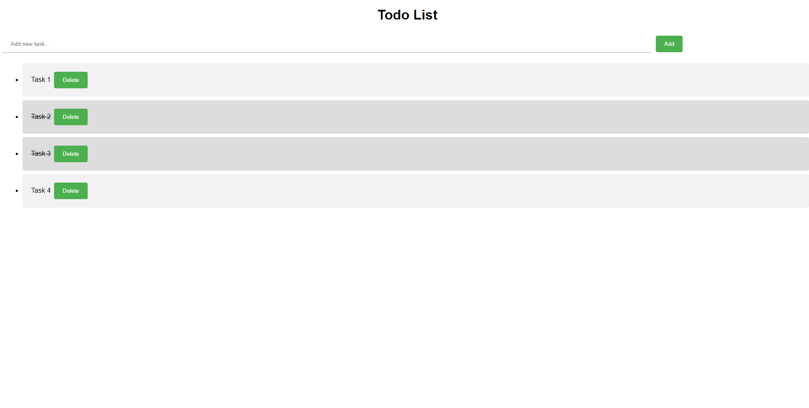

# Todo List Web App

This is a simple Todo List web app built using HTML, CSS, and JavaScript. You can use this app to keep track of your tasks and mark them as completed when you're done.

## Getting Started

To get started, simply clone or download the repository to your local machine and open the `index.html` file in your web browser. Alternatively, you can view a live demo of the app [here](https://example.com/todo-list).

## Usage

To add a new task, type the task description into the input field and click the "Add" button. The task will be added to the list.

To mark a task as completed, click on the task description. The task will be crossed out to indicate that it has been completed.

To delete a task, click the "Delete" button next to the task description.

